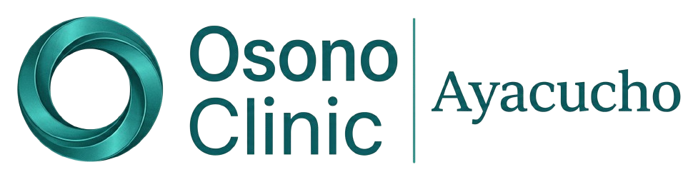

# Osono Clinic - Website de Ozonoterapia Médica



> Sitio web oficial de Osono Clinic - Especialistas en Ozonoterapia Médica y Regenerativa

## 🏥 Acerca del Proyecto

Osono Clinic es una clínica médica especializada en **ozonoterapia**, ofreciendo tratamientos avanzados para el dolor crónico, hernias discales y bienestar inmunológico. El sitio web está construido con [Astro](https://astro.build) para garantizar máximo rendimiento y SEO.

### Características Principales

- 🌿 Diseño moderno y profesional para clínica médica
- 📱 Totalmente responsivo (mobile-first)
- ⚡ Alto rendimiento con Astro
- 🎨 Integración con Tailwind CSS
- 🔍 Optimizado para SEO
- 💬 Integración con WhatsApp

---

## 🚀 Estructura del Proyecto

```text
/
├── public/                      # Archivos estáticos
│   ├── img/
│   │   ├── head/              # Logotipos
│   │   │   ├── logo.png
│   │   │   └── logo2.png
│   │   └── home/              # Imágenes del home
│   │       ├── baner.png
│   │       ├── baner2.png
│   │       ├── ozono_baner.png
│   │       └── ozonoterapia.jpg
│   ├── favicon.ico
│   ├── favicon.svg
│   └── icon.png
│
├── src/
│   ├── assets/                 # Assets compilados
│   │   ├── astro.svg
│   │   └── background.svg
│   │
│   ├── components/             # Componentes reutilizables
│   │   ├── Header.astro        # Navegación con efectos scroll
│   │   ├── Footer.astro        # Pie de página completo
│   │   └── Welcome.astro      # Componente de bienvenida
│   │
│   ├── layouts/                # Plantillas base
│   │   └── Layout.astro       # Layout principal HTML
│   │
│   ├── pages/                  # Páginas del sitio
│   │   └── index.astro        # Página principal
│   │
│   ├── styles/                 # Estilos CSS
│   │   ├── global.css         # Estilos globales y Tailwind
│   │   └── index.css          # Estilos específicos del home
│   │
│   └── js/                     # Scripts JavaScript
│       └── main.js             # Funcionalidades principales
│
├── astro.config.mjs           # Configuración de Astro
├── package.json               # Dependencias del proyecto
├── tsconfig.json              # Configuración de TypeScript
└── README.md                  # Este archivo
```

---

## 🛠️ Tecnologías Utilizadas

| Tecnología | Propósito |
|------------|-----------|
| **Astro** | Framework principal |
| **Tailwind CSS** | Estilos y utility classes |
| **Font Awesome** | Iconos |
| **Google Fonts** | Tipografía (Plus Jakarta Sans) |

---

## 📋 Secciones del Sitio

### Páginas Legales
El sitio incluye páginas legales en `/legales/`:
- `/legales/politica-privacidad` - Política de Privacidad
- `/legales/terminos-servicio` - Términos de Servicio
- `/legales/aviso-legal` - Aviso Legal

Cada página legal utiliza el layout `Layout_legal.astro` que incluye su propio header y footer optimizado.

### 1. Hero Section
- Banner principal con imagen de fondo
- Título: "Una vida sin dolor es posible"
- Subtítulo sobre ozonoterapia médica
- Botones de llamada a la acción
- Beneficios destacados (Sin cirugía, Recuperación rápida, Protocolos Alemanes)

### 2. ¿Qué es la Ozonoterapia?
- Explicación del tratamiento
- Cómo actúa en el organismo (4 puntos clave)
- Beneficios clínicos observados
- Disclaimer médico

### 3. Servicios/Terapias
- **Autohemoterapia Mayor**: Oxigenación profunda sistémica
- **Tratamiento de Columna**: Para hernias discales y dolor lumbar
- **Pie Diabético y Heridas**: Acción bactericida y regenerativa

### 4. Planes de Tratamiento
- Sesión Individual ($45)
- Pack Recuperación ($200/5 sesiones) - *Más Popular*
- Plan Regenerativo ($360/10 sesiones)

### 5. ¿Por qué elegirnos?
- Ciencia Aplicada (equipos grado médico)
- Especialistas capacitados
- Seguridad y biocompatibilidad
- Resultados desde primeras sesiones

### 6. FAQ (Preguntas Frecuentes)
- 4 preguntas con respuestas en formato acordeón
- Información sobre dolor, sesiones, seguridad y duración

### 7. Contacto
- Formulario de contacto
- Información de ubicación
- Botón flotante de WhatsApp

---

## 🎨 Sistema de Diseño

### Colores Principales

| Color | Hex | Uso |
|-------|-----|-----|
| Teal Primary | `#338B85` | Color principal, acentos |
| Teal Dark | `#2f7c77` | Hover states |
| Red Accent | `##ef4444` | Acentos estratégicos |
| Slate Dark | `#0f172a` | Textos oscuros |
| Slate Light | `#f8fafc` | Fondos |

### Tipografía

- **Familia**: Plus Jakarta Sans
- **Pesos**: 400, 500, 600, 700, 800

---

## ⚙️ Comandos Disponibles

Todos los comandos se ejecutan desde la raíz del proyecto:

| Comando | Acción |
|---------|--------|
| `npm install` | Instalar dependencias |
| `npm run dev` | Iniciar servidor dev en `localhost:4321` |
| `npm run build` | Construir para producción en `./dist/` |
| `npm run preview` | Previsualizar build local |
| `npm run astro -- --help` | Ayuda CLI de Astro |

---

## 🔧 Desarrollo

### Requisitos Previos

- Node.js 18.x o superior
- npm 9.x o superior

### Instalación

```bash
# Clonar el repositorio
git clone <repo-url>
cd Osono-Web

# Instalar dependencias
npm install

# Iniciar desarrollo
npm run dev
```

### Build para Producción

```bash
npm run build
# Los archivos se generan en ./dist/
```

### Preview del Build

```bash
npm run preview
```

---

## 📱 Configuración SEO

El sitio incluye meta tags optimizados:

```html
<title>Osono Clinic | Expertos en Ozonoterapia Médica y Regenerativa</title>
<meta name="description" content="Tratamientos avanzados de ozonoterapia para dolor crónico, hernias discales y bienestar inmunológico." />
<meta name="robots" content="index, follow" />
<meta name="theme-color" content="#0d9488" />
```

---

## 🔄 Personalización

### Cambiar Logo

1. Reemplazar `/public/img/head/logo.png` con el nuevo logo
2. Asegurar que las dimensiones sean apropiadas (se adapta automáticamente)

### Modificar Colores

Los colores principales están definidos en:
- `src/styles/global.css` (variables CSS)
- También puedes buscar y reemplazar `#338B85` en los archivos `.astro`

### Actualizar Información de Contacto

Editar en:
- `src/components/Footer.astro` - Información del pie de página
- `src/pages/index.astro` - Sección de contacto

---

## ⚠️ Disclaimer Médico

El sitio incluye disclaimers en:
- Sección de beneficios clínicos
- Pie de página

> *La ozonoterapia es un tratamiento complementario. Debe ser aplicado por profesionales de salud capacitados. Los resultados pueden variar según cada paciente y diagnóstico clínico.*

---

## 📄 Licencia

© 2026 Osono Clinic. Todos los derechos reservados.

---

## 📞 Contacto

- **Dirección**: Av. Salud Médica 123, Ciudad Salud
- **Teléfono**: +51 997 307 782
- **Email**: contacto@osonoclinic.com
- **Web**: [www.osonoclinic.com](#)

---

## 🐛 Problemas Comunes

### El servidor no inicia
```bash
# Verificar que las dependencias estén instaladas
npm install

# Limpiar cache
npm run astro -- clean
```

### Imágenes no cargan
Verificar que las rutas en `/public/` sean correctas y que los archivos existan.

### Estilos no se aplican
Asegurarse de que Tailwind CSS esté correctamente configurado en `astro.config.mjs`.

---

*Documentación actualizada: 2026*

