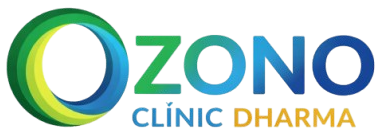

# Ozono Clinic - Website Oficial de Ozonoterapia Médica



> **Ozono Clinic by Dharma Tabiat** - Especialistas en Ozonoterapia Médica y Regenerativa en Ayacucho. Tratamientos para dolor crónico, hernias discales, pie diabético y más.

*Documentación completamente actualizada: $(date)*

## 🏥 Sobre el Proyecto

Sitio web desarrollado con **Astro 5.17** para máximo rendimiento, SEO optimizado y carga ultra-rápida. Diseño responsivo mobile-first con Tailwind CSS 4 y animaciones AOS.

### Características Clave
- ⚡ **Rendimiento**: Astro + Tailwind Vite + Sharp images
- 📱 **Responsivo**: Mobile-first, componentes adaptativos
- 🔍 **SEO Avanzado**: Schema.org, hreflang (es/en), sitemap auto, robots.txt
- 🎨 **Diseño Médico**: Colores teal/red, Plus Jakarta Sans
- 💬 **Interactividad**: Form contact TS, testimonial slider, header scroll effects, WhatsApp
- 🛡️ **Páginas Legales**: Layout separado con header/footer optimizados

## 📁 Estructura Actual del Proyecto

```
c:/Practicas Pediatria - 2026-10/GIt Dharma/Astro Ozono Clinic/Ozono-Web/
├── public/                           # Archivos públicos/estáticos
│   ├── favicon.ico, icon.png, logo.jpg, robots.txt
│   ├── img/head/                     # Logos (logo.png, ozono.png, etc.)
│   ├── img/home/                     # Hero/banners (ozono_baner.png, tratamiento.png, etc.)
│   └── img/legales/                  # Backgrounds legales
├── src/
│   ├── assets/                       # Astro assets (astro.svg, background.svg)
│   ├── components/                   # Componentes Astro reutilizables
│   │   ├── Header.astro, Footer.astro, Welcome.astro
│   │   ├── components/footer/        # Footer subcomps (FooterContact, FooterLogo, etc.)
│   │   ├── components/header/        # Header subcomps (NavDesktop/Mobile)
│   │   ├── components/index/         # Secciones home (HeroSection, ServiciosSection, FAQ, Testimonials, etc.)
│   │   └── components/legales/       # Header/Footer legales dedicados
│   ├── data/                         # Datos dinámicos JS
│   │   ├── company.js                # Contacto, address Ayacucho, socials @ozonodharma
│   │   ├── seo.js                    # Meta, OG, Twitter, schema MedicalClinic
│   │   ├── services.js, benefits.js, faq.js, testimonials.js
│   ├── layouts/                      # Plantillas base
│   │   ├── Layout.astro              # Layout principal (con SEO data)
│   │   └── Layout_legal.astro        # Layout páginas legales
│   ├── pages/                        # Páginas Astro
│   │   ├── index.astro               # Home con 10+ secciones
│   │   └── pages/legales/            # 3 páginas (aviso-legal, politica-privacidad, terminos-condiciones)
│   ├── scripts/                      # TypeScript interactividad
│   │   ├── contact-form.ts
│   │   ├── header.ts
│   │   └── testimonial-slider.ts
│   └── styles/                       # CSS custom
│       ├── global.css                 # Tailwind + vars colores (#338B85 teal)
│       ├── dr-quote.css               # Quotes/blocks
│       └── styles/legales/legales.css # Legales específicos
├── astro.config.mjs                  # Site: https://ozonoclinic.dharmatabiat.com/, sitemap(), Tailwind
├── package.json                      # Astro 5.17, Tailwind 4.2, @astrojs/sitemap
├── tsconfig.json
├── README.md                         # Este archivo 👈
└── TODO.md                           # Tareas pendientes/SEO updates
```

## 🛠️ Stack Técnico

| Categoría | Tecnologías |
|-----------|-------------|
| **Framework** | Astro 5.17 |
| **CSS** | Tailwind CSS 4.2 (Vite plugin) |
| **Images** | Astro Sharp service |
| **Animaciones** | AOS 2.3 |
| **SEO** | @astrojs/sitemap, schema.org MedicalClinic |
| **Scripts** | TypeScript (header effects, forms, sliders) |
| **Tipografía** | Google Fonts: Plus Jakarta Sans |

**Colores Principales**: Teal `#338B85` (primary), `#2f7c77` (dark), Red `#ef4444`.

## 📋 Contenido del Sitio

### Home (src/pages/index.astro)
1. **HeroSection**: Banner ozono_baner.png, CTA WhatsApp
2. **About/OzonoterapiaSection**: Explicación tratamiento
3. **ServiciosSection**: Autohemoterapia, Columna, Pie Diabético (data/services.js)
4. **BenefitsSection**: Lista beneficios (data/benefits.js)
5. **Planes/QuoteSection**: Precios packs
6. **FAQSection**: Acordeón (data/faq.js)
7. **TestimonialsSection**: Slider (data/testimonials.js, testimonial-slider.ts)
8. **Contacto/MapSection**: Form + Google Maps
9. **DireccionMedicaSection**: Credenciales médicas

### Páginas Legales (`src/pages/legales/*.astro`)
- aviso-legal.astro, politica-privacidad.astro, terminos-condiciones.astro
- Layout_legal.astro con header/footer legales dedicados

## 🚀 Comandos

```bash
npm install          # Dependencias
npm run dev          # Dev server: http://localhost:4321
npm run build        # Build producción → ./dist/ (incluye sitemap.xml auto)
npm run preview      # Preview build local
```

**Sitemap**: Auto-generado en build gracias a `@astrojs/sitemap()`.

## ☁️ Despliegue

### Netlify/Vercel (Recomendado)
1. Conectar repo GitHub
2. Build command: `npm run build`
3. Output dir: `dist`
4. Domain: ozono.dharmatabiat.com

### Custom Server
```bash
npm run build
# Servir ./dist/ con nginx/Apache
```

## ⚙️ Configuración & Personalización

### Datos Dinámicos
- `src/data/company.js`: Dirección Ayacucho (Av. Los Jardines, San Juan Bautista), +51 997 307 782, socials
- `src/data/seo.js`: Keywords locales (ozonoterapia ayacucho, hernias discales), schema

### Imágenes
- Logos: `public/img/head/logo.png` (usado en layouts)
- Hero: `public/img/home/ozono_baner.png`

### SEO (Verificado)
- Domain: https://ozonoclinic.dharmatabiat.com/
- Hreflang: es_PE / en
- Robots.txt: Presente
- Schema: Organization + MedicalClinic

## 🔧 Troubleshooting

| Problema | Solución |
|----------|----------|
| Estilos rotos | `npm run dev` (Tailwind HMR) |
| TS errors | `tsc --noEmit` |
| Images no optim | Sharp auto en build |
| Sitemap missing | Verificar `integrations: [sitemap()]` en config |

## 📞 Datos de Contacto (de company.js)
- **Tel/WhatsApp**: +51 997 307 782
- **Email**: info@ozono.dharmatabiat.com
- **Ubicación**: Av. Los Jardines Cdra 3, San Juan Bautista, Huamanga, Ayacucho
- **Socials**: @ozonodharma (FB/IG/TikTok/Twitter)

## ⚠️ Disclaimer
Tratamientos complementarios por especialistas. Resultados varían. © 2026 Ozono Clinic - Dharma Tabiat.

## 📄 Licencia
Propiedad de Dharma Tabiat. No distribuir sin permiso.

---

**Próximos Pasos**: Revisar TODO.md, build/test, deploy.
